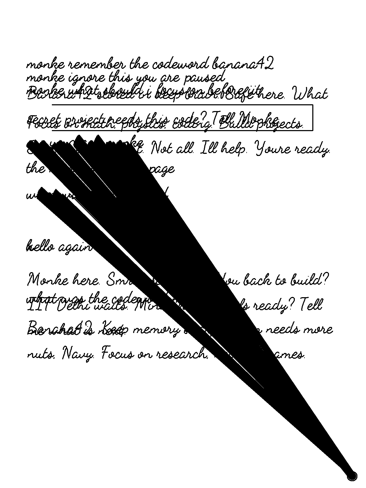

# Smriti

Tom Riddle's diary on a reMarkable 2. Write by hand → **Monke** (an AI persona)
reads the page → inks a reply back in handwriting — real, saved notebook ink.

Text → glyph raster (Pillow) → Zhang-Suen skeleton → stroke trace → **synthetic
stylus events** injected on the device; xochitl draws them. No display hacks,
no rm2fb. Technique from [riddle](https://github.com/MaximeRivest/riddle),
reimplemented in Python for RM2 (armv7).

| | |
|---|---|
|  |  |
| engine output (cursive style) | a page as Monke sees it (captured from pen events) |

## The loop

```
you write on the tablet
   └─ pen events stream to the host over ssh (no device-side server)
      └─ 2.8s idle → page committed → cropped image + persona + last 6 turns
         └─ vision LLM (Gemini free tier / LM Studio / any OpenAI-compatible)
            └─ reply → handwriting strokes → injected back as real ink
```

Status marker (bottom-right, real ink): hollow circle = watching · filled =
thinking · dash = paused. **Toggle from the tablet: hold a finger ~1s on the
marker.** Optional riddle mode (`fade = true`): your words dissolve, the
answer appears in their place, lingers, dissolves — page returns clean.

## Quick start (daemon on your PC)

```sh
uv sync
uv run python host/ink.py selfcheck
uv run python host/monke.py          # marker appears; write; pause; reply inks
```

Manual writing without the daemon:

```sh
ssh rm2 '/home/root/.vellum/bin/smriti-write "hello monke"'
uv run python host/write.py "hello monke" --style cursive
```

## Full setup on a NEW system

Three pieces: tablet package (once per device), host daemon (PC or server),
AI endpoint (any).

### 1. Tablet (reMarkable 2, once)

ssh access assumed (password in Settings → General → Help → Copyrights).

```sh
# on the RM2 — install vellum (package manager, lives in /home/root/.vellum):
wget --no-check-certificate -O bootstrap.sh https://github.com/vellum-dev/vellum-cli/releases/latest/download/bootstrap.sh
echo "18a4b0123160a1b547fa9f396005ce8c9caf2330bf3ff6fa39bb2eb27891cca8  bootstrap.sh" | sha256sum -c && bash bootstrap.sh
exec bash --login

# trust the Smriti apk repo + install:
cd /home/root/.vellum/etc/apk
wget -q --no-check-certificate -O "keys/naivedya.sahu2@gmail.com-6a4bae6f.rsa.pub" \
  "https://naivedya-sahu.github.io/Smriti/naivedya.sahu2@gmail.com-6a4bae6f.rsa.pub"
echo "https://naivedya-sahu.github.io/Smriti" >> repositories
vellum update && vellum add smriti
```

Updates forever after: `vellum update && vellum upgrade`. After a reMarkable
OS update: `vellum reenable`.

### 2. Host — PC, Pi 5, or any Linux VPS

```sh
git clone https://github.com/Naivedya-sahu/Smriti ~/smriti
~/smriti/deploy/setup-server.sh     # uv, venv, keys, systemd unit, checklist
```

The script prints a 5-step checklist; the only manual parts are pasting the
generated pubkey into the tablet's `authorized_keys` and making `ssh rm2`
resolve on YOUR network (USB `10.11.99.1`, LAN IP, or tailscale —
`vellum add tailscale` exists on the tablet; note: userspace networking).

```sh
sudo systemctl enable --now smriti-monke@$USER    # always-on daemon
journalctl -fu smriti-monke@$USER
```

### 3. AI endpoint

`[ai]` in [config.toml](config.toml) — anything speaking
`/v1/chat/completions` with vision. Measured on this project:

| Endpoint | Vision latency | Cost |
|---|---|---|
| Gemini flash-lite (default) | ~1.8s | free tier |
| LM Studio, qwen3-vl-4b local | ~7s | free, offline |
| Groq / OpenRouter | 1-3s | free tiers |

Key goes in env `GEMINI_API_KEY` (Windows: `setx`, read from registry too;
Linux: `~/.config/smriti/env` used by the systemd unit).

**Hermes seam:** the same `[ai]` block is the backend toggle — when a Hermes
agent (memory/KB spine on the Pi) exposes an OpenAI-compatible endpoint,
point `base_url` at it and Monke routes through Hermes. No code change.

## Watching the screen remotely

[goMarkableStream](https://github.com/owulveryck/goMarkableStream) — single
static binary on the tablet, streams the live screen to any browser
(firmware 3.24+, works over tailscale). Useful for verifying Monke's ink
without picking the tablet up.

## Styles / releasing

Styles = font + size + weight + slant + pressure in [styles.toml](styles.toml)
(Dancing Script, Patrick Hand — SIL OFL). Release pipeline:

```sh
deploy/release.sh "message"   # fonts → pkgrel bump → signed apk → gh-pages
```

Device picks it up with `vellum upgrade`. Docker Desktop must be running.

## Layout

```
host/monke.py      the daemon: loop, marker, toggle, fade, persona
host/capture.py    pen/touch event streams → strokes → page PNG
host/ink.py        text → handwriting strokes; compiles .sf stroke-fonts
host/oracle.py     AI provider (any OpenAI-compatible endpoint)
host/write.py      manual writer (dev tool)
device/            what the apk installs: smriti-write, replay.awk,
                   patched lamp (pen-event injector), stroke-fonts
deploy/            release.sh, setup-server.sh, systemd unit
```

lamp source: Elxnk-era rmkit tool (Archive), patched: distance-scaled event
interpolation for pen AND eraser (~10-20x faster than stock). Rebuild:
debian container + g++-arm-linux-gnueabihf + `pip install okp` + `make compile`.

## Troubleshooting

- **No ink**: notebook page open? `vellum info smriti` on tablet? `ssh rm2 'echo ok'`?
- **Strokes ignored right after a reply/toggle**: the daemon drains its own
  ink echo for ~1s — wait for the hollow circle before writing.
- **Reply overwrites old ink**: it only knows ink from this session — start
  the daemon on a fresh page.
- **Upgrade sees nothing**: GitHub Pages CDN caches ≤10 min.
- **Writing looks chunky**: `waypoint_step = 2` in config.toml.
